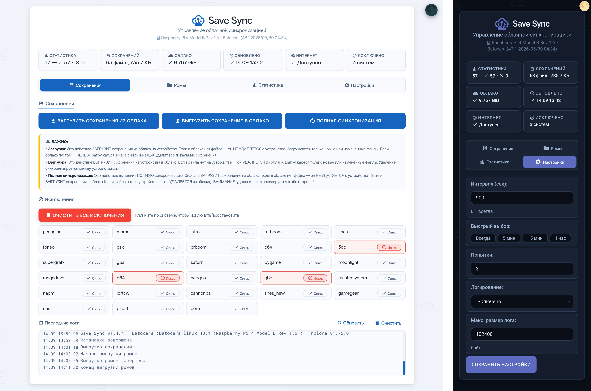
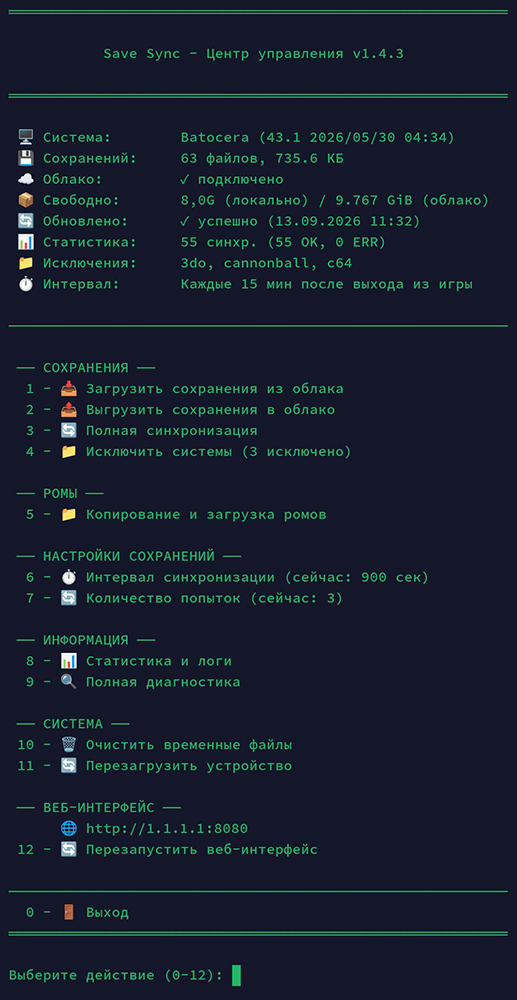

# Save Sync

**RU** · English below ↓

Облачная синхронизация сохранений и резервное копирование ромов для ретро-приставок и портативок на **Batocera**, **KNULLI** и **Recalbox**.

Сохранились на одном устройстве — включили другое — продолжаете с того же места. Работает в фоне, не мешает игровому процессу. Управлять можно как с самого устройства, так и через веб-интерфейс в браузере.

*Проверено: Batocera 43.1, Recalbox 10.0.8, KNULLI Scarab*

---

## Что умеет

- Автоматически синхронизирует сохранения с облаком по протоколу **WebDAV** (через [rclone](https://rclone.org/))
- Синхронизация при включении устройства (забирает свежие сохранения) и при выходе из игры (отправляет новые/изменённые)
- Удаление тоже синхронизируется — удалили сохранение на одном устройстве, оно исчезнет из облака и с других устройств
- Резервное копирование и восстановление ромов — выгрузить коллекцию в облако или скачать оттуда ромы (и целые системы), которых ещё нет на устройстве
- Работает и с одним-единственным устройством — тогда это просто автоматический бэкап сохранений

## Скриншоты





## Поддерживаемые облака

Подойдёт любое хранилище с поддержкой WebDAV, включая:

- Яндекс.Диск
- Облако Mail.ru
- pCloud
- Koofr
- Nextcloud / OwnCloud (свой сервер)
- Fastmail Files
- Mega

Для Яндекса, Mail.ru и Fastmail нужен **пароль приложения**, а не обычный пароль от аккаунта — установщик подскажет, где его создать для выбранного сервиса.

## Установка

**1. Скопируйте `install_sync.sh` на устройство**

Проще всего — через сетевую папку:
```
\\batocera\share\system\   (Batocera)
\\knulli\share\system\     (KNULLI)
\\recalbox\share\system\   (Recalbox)
```
Или через FTP (логин `root`, пароль `linux` для Batocera/KNULLI, `recalboxroot` для Recalbox), в папку `system/`.

**2. Подключитесь по SSH**
```bash
ssh root@IP_АДРЕС_УСТРОЙСТВА
```

**3. Запустите установщик**

Batocera / KNULLI:
```bash
chmod +x /userdata/system/install_sync.sh
/userdata/system/install_sync.sh
```
Recalbox:
```bash
chmod +x /recalbox/share/system/install_sync.sh
/recalbox/share/system/install_sync.sh
```

> **На Recalbox выдаёт "Permission denied"?** На части сборок раздел `/recalbox/share` не поддерживает исполнение файлов напрямую. Ставьте `bash` или `sh` перед каждой командой:
> ```bash
> sh /recalbox/share/system/install_sync.sh
> ```

**4. Следуйте инструкциям на экране** — выберите облачный сервис, введите логин и пароль, дождитесь окончания установки. Если скрипт уже установлен, вместо этого предложит обновиться с сохранением текущих настроек.

## Центр управления

```bash
install_sync.sh --config
```

Всё через меню: ручная синхронизация, исключение систем из синхронизации, копирование и загрузка ромов, интервал синхронизации, количество попыток, статистика и логи, полная диагностика, перезапуск веб-интерфейса.

## Веб-интерфейс

После установки автоматически запускается веб-сервер:
```
http://IP_АДРЕС_УСТРОЙСТВА:8080
```
Дублирует все функции центра управления — синхронизацию, работу с ромами, исключения, живой прогресс, статистику, логи — из браузера любого устройства в той же сети. (Если не открывается сразу после установки — перезапустите через центр управления или перезагрузите устройство.)

Работает по обычному HTTP без сертификата — браузер может пометить страницу как «Не защищено». Это ожидаемо и не страшно в пределах домашней сети — настоящий SSL-сертификат не имеет смысла для устройства с локальным IP.

## Диагностика

```bash
install_sync.sh --info
```
Проверка версии rclone, подключения к облаку, прав на скрипты, значений конфига, свободного места (локально и в облаке), состояния интернета, последних записей лога — всё в одном месте.

## Частые вопросы

**Будет ли работать на других системах?**
Сейчас — Batocera, KNULLI, Recalbox. Если хотите поддержку другой прошивки — заведите issue, посмотрю, что можно сделать.

**Нужен ли постоянный интернет?**
Только ненадолго — при включении устройства и при выходе из игры. Всё остальное время можно играть офлайн, сохранения синхронизируются при следующем подключении к сети.

**Зачем исключать систему из синхронизации?**
Некоторые системы (MAME, Final Burn Neo) создают крупные сохранения, которые не обязательно держать в облаке. Исключить можно через центр управления или веб-интерфейс.

**Как добавить ромы без кард-ридера и FTP?**
Закиньте их в `GameROMs/<система>/` в облаке, затем запустите загрузку ромов с устройства — они появятся в нужных папках сами.

**Удалил сохранение, а в облаке осталось?**
Исчезнет при следующем выходе из игры (это и запускает синхронизацию), либо сразу — если зайти в любую игру и выйти, чтобы вызвать синхронизацию принудительно.

**Сохранение есть, но игра не продолжается с этого места?**
Некоторые эмуляторы (MAME, Final Burn Neo) не подгружают сохранение автоматически при запуске — загрузите вручную горячими клавишами (обычно Select + кнопка).

**Можно другое облако?**
Да, если оно работает через WebDAV — при установке выберите пункт «Nextcloud/OwnCloud/другой WebDAV» и введите свой адрес сервера.

## Лицензия / благодарности

Синхронизация построена поверх [rclone](https://rclone.org/), который и делает всю работу по передаче данных через WebDAV.

Багрепорты и предложения — через Issues / Pull Requests.

MIT — см. [LICENSE](LICENSE).

# Save Sync

**EN** · Русский выше ↑

Cloud save synchronization and ROM backup for retro gaming handhelds and consoles running **Batocera**, **KNULLI**, or **Recalbox**.

Save on one device, turn on another, keep playing from where you left off. Runs quietly in the background — no interruption to your gaming session. Manage everything from the device itself or from a browser on your phone/PC.

*Tested on: Batocera 43.1, Recalbox 10.0.8, KNULLI Scarab*

---

## What it does

- Automatically syncs your save files to the cloud over **WebDAV**, using [rclone](https://rclone.org/) under the hood
- Syncs on boot (pulls the latest saves) and on game exit (pushes new/changed saves)
- Deletions sync too — remove a save on one device, it disappears from the cloud and from your other device as well
- Optional ROM backup and restore — upload your ROM collection to the cloud, or pull down ROMs (and whole systems) you don't have locally yet
- Works for a single device too — it doubles as an automatic save backup even if you never touch a second device

## Screenshots


## Supported clouds

Any WebDAV-compatible storage works, including:

- Yandex.Disk
- Mail.ru Cloud
- pCloud
- Koofr
- Nextcloud / ownCloud (bring your own server)
- Fastmail Files
- Mega

Yandex, Mail.ru, and Fastmail require an **app password** rather than your regular account password — the installer will tell you where to generate one for whichever service you pick.

## Installation

**1. Copy `install_sync.sh` onto your device**

Easiest way — over the network:
```
\\batocera\share\system\   (Batocera)
\\knulli\share\system\     (KNULLI)
\\recalbox\share\system\   (Recalbox)
```
Or via FTP (login `root`, password `linux` for Batocera/KNULLI, `recalboxroot` for Recalbox), into the `system/` folder.

**2. SSH into the device**
```bash
ssh root@YOUR_DEVICE_IP
```

**3. Run the installer**

Batocera / KNULLI:
```bash
chmod +x /userdata/system/install_sync.sh
/userdata/system/install_sync.sh
```
Recalbox:
```bash
chmod +x /recalbox/share/system/install_sync.sh
/recalbox/share/system/install_sync.sh
```

> **Recalbox "Permission denied"?** Some Recalbox builds mount `/recalbox/share` in a way that blocks direct execution. Prefix every manual command with `bash` or `sh` instead:
> ```bash
> sh /recalbox/share/system/install_sync.sh
> ```

**4. Follow the prompts** — pick your cloud service, enter your credentials, and installation finishes on its own. If a previous install is detected, you'll be offered an update instead, with your existing settings preserved.

## Control panel

```bash
install_sync.sh --config
```

Everything is menu-driven from here: manual sync, excluding specific systems from save sync, ROM backup/restore, sync interval, retry count, statistics and logs, full diagnostics, and restarting the web interface.

## Web interface

After installation, a small web server starts automatically:
```
http://YOUR_DEVICE_IP:8080
```
It mirrors every feature in the control panel — sync, ROM management, exclusions, live progress, statistics, logs — from any browser on the same network. (If it doesn't come up right away after a fresh install, restart it from the control panel or just reboot the device.)

It's plain HTTP with no certificate — your browser may flag it as "not secure." That's expected and not a concern on a local home network; a real TLS certificate wouldn't make sense for a device with a local IP address anyway.

## Diagnostics

```bash
install_sync.sh --info
```
Checks rclone version, cloud connectivity, script permissions, config values, free space (local and cloud), internet status, and recent log entries — all in one place.

## FAQ

**Will this work on other systems?**
Currently Batocera, KNULLI, and Recalbox. Open an issue if you'd like another CFW supported — happy to look into it.

**Do I need a constant internet connection?**
Only briefly, at boot and when exiting a game. Play offline the rest of the time; saves sync automatically once you're back online.

**Why exclude a system from sync?**
Some systems (MAME, FinalBurn Neo) produce large save files you may not want cluttering your cloud storage. Exclude them from the control panel or web UI.

**Can I add ROMs without a card reader or FTP access?**
Drop them into `GameROMs/<system>/` in your cloud storage, then run a ROM download from the device — they'll land in the right folders automatically.

**Deleted a save but it's still in the cloud?**
It disappears on the next game exit (which triggers a sync), or immediately if you launch and quit any game to force one.

**A save exists but the game doesn't resume from it?**
Some emulators (MAME, FinalBurn Neo) don't auto-load saves on launch — load manually with the in-game hotkey (usually Select + a face button).

**Can I use a different cloud provider?**
Yes, if it speaks WebDAV — pick the "Nextcloud/ownCloud/other WebDAV" option during setup and enter your own server URL.

## License / Credits

Built on top of [rclone](https://rclone.org/) for the actual WebDAV transfer work.

Contributions, bug reports, and feature requests are welcome via Issues / Pull Requests.

MIT — see [LICENSE](LICENSE).