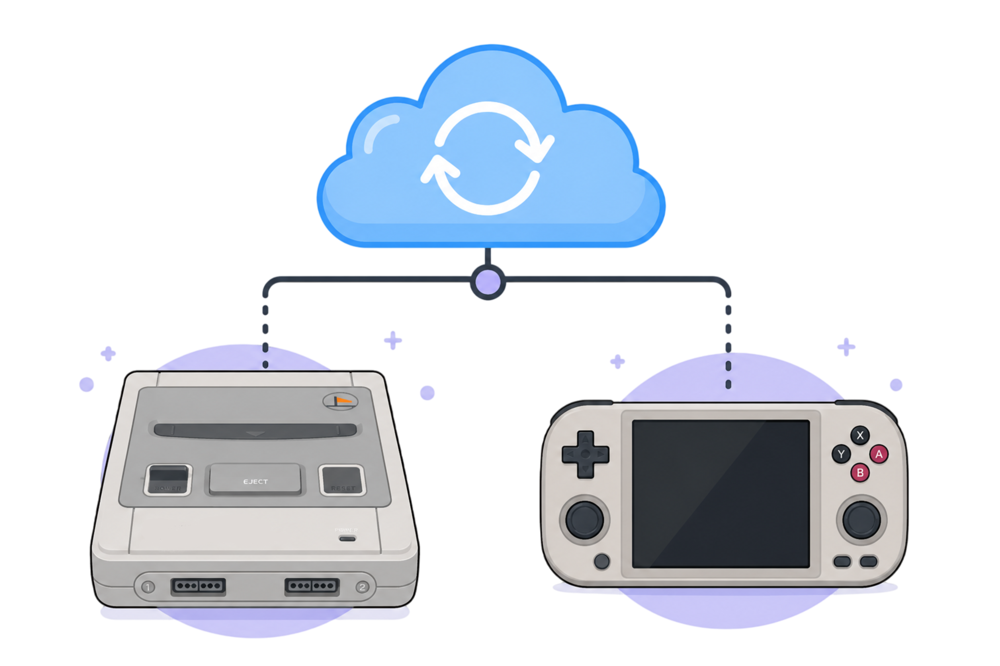
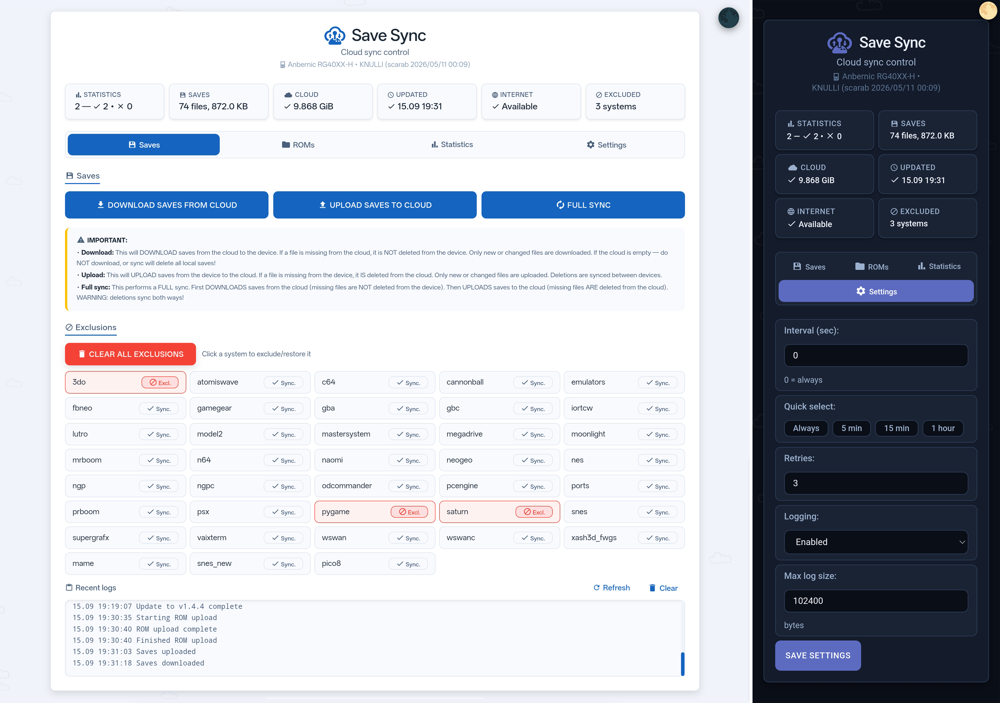
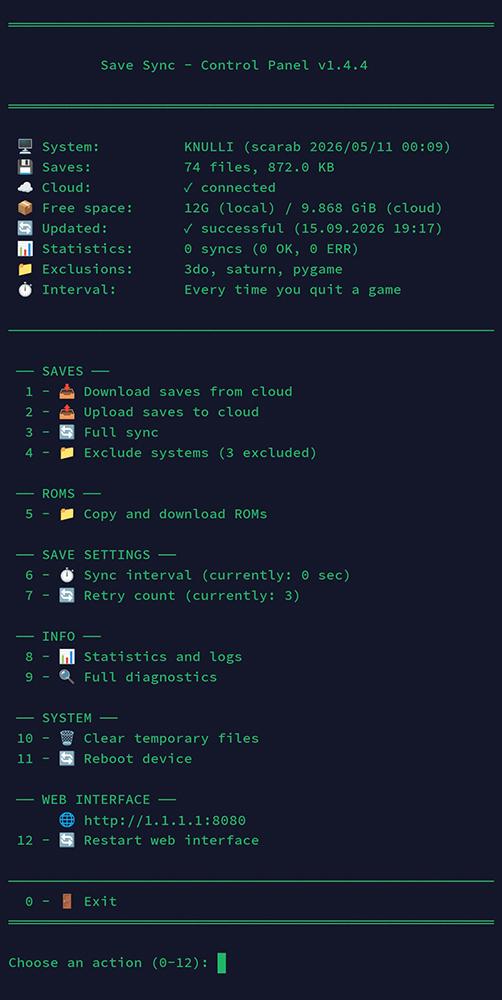

<a name="top"></a>

<p align="center">
  
</p>

<h1 align="center">Save Sync</h1>


**RU** · [English below ↓](#english)

Облачная синхронизация сохранений и резервное копирование ромов для ретро-приставок и портативок на **Batocera**, **KNULLI** и **Recalbox**.

Сохранились на одном устройстве — включили другое — продолжаете с того же места. Работает в фоне, не мешает игровому процессу. Управлять можно как с самого устройства, так и через веб-интерфейс в браузере.

*Проверено: Batocera 43.1, Recalbox 10.0.8, KNULLI Scarab*

---

## Что умеет

- Автоматически синхронизирует сохранения с облаком по протоколу **WebDAV** (через [rclone](https://rclone.org/))
- Синхронизация при включении устройства (забирает свежие сохранения) и при выходе из игры (отправляет новые/изменённые)
- Удаление тоже синхронизируется — удалили сохранение на одном устройстве, оно исчезнет из облака и с других устройств
- Резервное копирование и восстановление ромов — выгрузить коллекцию в облако или скачать оттуда ромы (и целые системы), которых ещё нет на устройстве
- Работает и с одним устройством — как автоматический бэкап сохранений

## Как работает синхронизация

**Включили устройство** — забирает из облака все сохранения. Если играли на другом устройстве, прогресс уже будет здесь.

**Вышли из игры** — отправляет новые и изменённые сохранения в облако в фоне.

**Удалили сохранение** — при следующем выходе из игры оно удалится из облака, а при включении другого устройства удалится и там.

> **Важно:** не запускайте одну и ту же игру на двух устройствах одновременно. Если выйти из игры на обоих, в облаке останется сохранение с того устройства, которое вышло последним — предыдущее будет потеряно.


## Скриншоты


## Поддерживаемые облака

Подойдёт любое хранилище с поддержкой WebDAV, включая:

- Яндекс.Диск
- Облако Mail.ru
- pCloud
- Koofr
- Nextcloud / OwnCloud (свой сервер)
- Fastmail Files
- Mega

Для Яндекса, Mail.ru и Fastmail нужен **пароль приложения**, а не обычный пароль от аккаунта — установщик подскажет, где его создать для выбранного сервиса.

## Установка

**1. Скопируйте `install_sync.sh` на устройство**

> Если вам удобнее английский интерфейс — используйте `install_sync_en.sh`
> из того же релиза. Перед запуском переименуйте его в `install_sync.sh`,
> иначе скрипт не найдёт сам себя при автозагрузке.

Проще всего — через сетевую папку:
```
\\batocera\share\system\   (Batocera)
\\knulli\share\system\     (KNULLI)
\\recalbox\share\system\   (Recalbox)
```
Или через FTP (логин `root`, пароль `linux` для Batocera/KNULLI, `recalboxroot` для Recalbox), в папку `system/`.

**2. Подключитесь по SSH**
```bash
ssh root@IP_АДРЕС_УСТРОЙСТВА
```

**3. Запустите установщик**

Batocera / KNULLI:
```bash
chmod +x /userdata/system/install_sync.sh
/userdata/system/install_sync.sh
```
Recalbox:
```bash
chmod +x /recalbox/share/system/install_sync.sh
/recalbox/share/system/install_sync.sh
```

> **На Recalbox выдаёт "Permission denied"?** На части сборок раздел `/recalbox/share` не поддерживает исполнение файлов напрямую. Ставьте `bash` или `sh` перед каждой командой:
> ```bash
> sh /recalbox/share/system/install_sync.sh
> ```

**4. Следуйте инструкциям на экране** — выберите облачный сервис, введите логин и пароль, дождитесь окончания установки. Если скрипт уже установлен, вместо этого предложит обновиться с сохранением текущих настроек.

## Центр управления

Batocera / KNULLI:
```bash
/userdata/system/install_sync.sh --config
```
Recalbox:
```bash
/recalbox/share/system/install_sync.sh --config
```

Всё через меню: ручная синхронизация, исключение систем из синхронизации, копирование и загрузка ромов, интервал синхронизации, количество попыток, статистика и логи, полная диагностика, перезапуск веб-интерфейса.

## Веб-интерфейс

После установки автоматически запускается веб-сервер:
```
http://IP_АДРЕС_УСТРОЙСТВА:8080
```
Дублирует все функции центра управления — синхронизацию, работу с ромами, исключения, живой прогресс, статистику, логи — из браузера любого устройства в той же сети. (Если не открывается сразу после установки — перезапустите через центр управления или перезагрузите устройство.)

Работает по обычному HTTP без сертификата — браузер может пометить страницу как «Не защищено». Это ожидаемо и не страшно в пределах домашней сети — настоящий SSL-сертификат не имеет смысла для устройства с локальным IP.

## Диагностика

Batocera / KNULLI:
```bash
/userdata/system/install_sync.sh --info
```
Recalbox:
```bash
/recalbox/share/system/install_sync.sh --info
```
Проверка версии rclone, подключения к облаку, прав на скрипты, значений конфига, свободного места (локально и в облаке), состояния интернета, последних записей лога — всё в одном месте.

## Частые вопросы

**Будет ли работать на других системах?**
Сейчас — Batocera, KNULLI, Recalbox. Если хотите поддержку другой прошивки — заведите issue, посмотрю, что можно сделать.

**Можно синхронизировать несколько устройств с одной и той же прошивкой — например, три устройства на KNULLI?**
Да, работает с любым числом устройств в любом сочетании — они не «спарены» друг с другом, а просто используют одну общую папку в облаке. Каждое устройство независимо забирает файлы при включении и отправляет при выходе из игры. Три устройства на KNULLI — совершенно нормальная конфигурация, как и любая смесь платформ (KNULLI + Batocera + Recalbox одновременно). Устройства никогда не общаются друг с другом напрямую — они просто используют один и тот же облачный аккаунт.

**Нужен ли постоянный интернет?**
Только ненадолго — при включении устройства и при выходе из игры. Всё остальное время можно играть офлайн, сохранения синхронизируются при следующем подключении к сети.

**Сколько времени занимает синхронизация?**
Зависит от размера файлов и скорости интернета. Крупные сохранения (1–4 МБ) могут идти несколько минут. После игры с тяжёлыми сохранениями не выключайте устройство сразу — дайте немного времени. То же самое при загрузке: большие сохранения подтягиваются не мгновенно.

**Что такое интервал синхронизации?**
Минимальное время между синхронизациями. Например, если установить 5 минут, синхронизация при выходе из игры выполнится, только если с предыдущей прошло больше 5 минут — это помогает не перегружать облако при частых выходах из игры.

**Зачем исключать систему из синхронизации?**
Исключение ускоряет синхронизацию и экономит трафик. Некоторые системы (MAME, Final Burn Neo) создают крупные сохранения, которые не обязательно держать в облаке. Исключить можно через центр управления или веб-интерфейс.

**Как добавить ромы без кард-ридера и FTP?**
Закиньте их в `GameROMs/<система>/` в облаке, затем запустите загрузку ромов с устройства — они появятся в нужных папках сами.

**Что именно делает "Копирование и загрузка ромов"?**
Это не двусторонняя синхронизация, а резервное копирование и восстановление по отдельности. Выгрузка отправляет ромы в облако (создаёт копию), загрузка — забирает их обратно (восстанавливает на устройстве). При выгрузке файлы, которых больше нет на устройстве, удаляются и из облачной копии.

**Удалил сохранение, а в облаке осталось?**
Исчезнет при следующем выходе из игры (это и запускает синхронизацию) — а когда включите другое устройство, удалится и там. Если хотите синхронизировать сразу, зайдите в любую игру и выйдите, чтобы вызвать синхронизацию принудительно.

**Сохранение есть, но игра не продолжается с этого места?**
Некоторые эмуляторы (MAME, Final Burn Neo) не подгружают сохранение автоматически при запуске — загрузите вручную горячими клавишами (обычно Select + кнопка).

**Загружается не тот слот сохранения?**
В каждом устройстве свой счётчик слотов. Если на одном сохранение в слоте 3, а на другом — в слоте 2, по горячим клавишам загрузится последний использованный слот именно на этом устройстве. Найдите нужное через менеджер сохранений — либо скопируйте сохранение в свободный слот и загрузите оттуда.

**Внутриигровые сохранения не видны?**
Запустите игру один раз, выйдите и зайдите снова — эмулятор подхватит файл.

**Можно другое облако?**
Да, если оно работает через WebDAV — при установке выберите пункт «Nextcloud/OwnCloud/другой WebDAV» и введите свой адрес сервера.

## Лицензия / благодарности

Синхронизация построена поверх [rclone](https://rclone.org/), который и делает всю работу по передаче данных через WebDAV.

MIT — см. [LICENSE](LICENSE).

Багрепорты и предложения — через Issues / Pull Requests.

---

<a name="english"></a>

<p align="center">
  
</p>

<h1 align="center">Save Sync</h1>


**EN** · [Русский выше ↑](#top)

Cloud save synchronization and ROM backup for retro gaming handhelds and consoles running **Batocera**, **KNULLI**, or **Recalbox**.

Save on one device, turn on another, keep playing from where you left off. Runs quietly in the background — no interruption to your gaming session. Manage everything from the device itself or from a browser on your phone/PC.

*Tested on: Batocera 43.1, Recalbox 10.0.8, KNULLI Scarab*

---

## What it does

- Automatically syncs your save files to the cloud over **WebDAV**, using [rclone](https://rclone.org/) under the hood
- Syncs on boot (pulls the latest saves) and on game exit (pushes new/changed saves)
- Deletions sync too — remove a save on one device, it disappears from the cloud and from your other device as well
- Optional ROM backup and restore — upload your ROM collection to the cloud, or pull down ROMs (and whole systems) you don't have locally yet
- Works for a single device too — it doubles as an automatic save backup even if you never touch a second device

## How syncing works

**Turn on a device** — it pulls all saves from the cloud. If you played on another device, that progress is already here.

**Exit a game** — pushes new and changed saves to the cloud in the background.

**Delete a save** — it's removed from the cloud on the next game exit, and from other devices the next time they boot.

> **Important:** don't run the same game on two devices at the same time. If you exit on both, the cloud keeps whichever device's save was pushed last — the other one is lost.

## Screenshots





## Supported clouds

Any WebDAV-compatible storage works, including:

- Yandex.Disk
- Mail.ru Cloud
- pCloud
- Koofr
- Nextcloud / ownCloud (bring your own server)
- Fastmail Files
- Mega

Yandex, Mail.ru, and Fastmail require an **app password** rather than your regular account password — the installer will tell you where to generate one for whichever service you pick.

## Installation

**1. Copy `install_sync.sh` onto your device**

> Prefer the English interface? Use `install_sync_en.sh` from the same
> release. Rename it to `install_sync.sh` before running — otherwise the
> script won't find itself on autostart.

Easiest way — over the network:
```
\\batocera\share\system\   (Batocera)
\\knulli\share\system\     (KNULLI)
\\recalbox\share\system\   (Recalbox)
```
Or via FTP (login `root`, password `linux` for Batocera/KNULLI, `recalboxroot` for Recalbox), into the `system/` folder.

**2. SSH into the device**
```bash
ssh root@YOUR_DEVICE_IP
```

**3. Run the installer**

Batocera / KNULLI:
```bash
chmod +x /userdata/system/install_sync.sh
/userdata/system/install_sync.sh
```
Recalbox:
```bash
chmod +x /recalbox/share/system/install_sync.sh
/recalbox/share/system/install_sync.sh
```

> **Recalbox "Permission denied"?** Some Recalbox builds mount `/recalbox/share` in a way that blocks direct execution. Prefix every manual command with `bash` or `sh` instead:
> ```bash
> sh /recalbox/share/system/install_sync.sh
> ```

**4. Follow the prompts** — pick your cloud service, enter your credentials, and installation finishes on its own. If a previous install is detected, you'll be offered an update instead, with your existing settings preserved.

## Control panel

Batocera / KNULLI:
```bash
/userdata/system/install_sync.sh --config
```
Recalbox:
```bash
/recalbox/share/system/install_sync.sh --config
```

Everything is menu-driven from here: manual sync, excluding specific systems from save sync, ROM backup/restore, sync interval, retry count, statistics and logs, full diagnostics, and restarting the web interface.

## Web interface

After installation, a small web server starts automatically:
```
http://YOUR_DEVICE_IP:8080
```
It mirrors every feature in the control panel — sync, ROM management, exclusions, live progress, statistics, logs — from any browser on the same network. (If it doesn't come up right away after a fresh install, restart it from the control panel or just reboot the device.)

It's plain HTTP with no certificate — your browser may flag it as "not secure." That's expected and not a concern on a local home network; a real TLS certificate wouldn't make sense for a device with a local IP address anyway.

## Diagnostics

Batocera / KNULLI:
```bash
/userdata/system/install_sync.sh --info
```
Recalbox:
```bash
/recalbox/share/system/install_sync.sh --info
```
Checks rclone version, cloud connectivity, script permissions, config values, free space (local and cloud), internet status, and recent log entries — all in one place.

## FAQ

**Will this work on other systems?**
Currently Batocera, KNULLI, and Recalbox. Open an issue if you'd like another CFW supported — happy to look into it.

**Can I sync multiple devices running the same CFW — say, three KNULLI handhelds?**
Yep, works between any number of devices in any combination — it's not paired, it's all through one shared cloud folder. Every device pulls on boot and pushes on game exit, independently. Three KNULLI handhelds with no Batocera anywhere is a totally valid setup, same as a mixed one (KNULLI + Batocera + Recalbox together). They never talk to each other directly — they just share the same cloud account.

**Do I need a constant internet connection?**
Only briefly, at boot and when exiting a game. Play offline the rest of the time; saves sync automatically once you're back online.

**How long does syncing take?**
Depends on file size and connection speed. Larger saves (1–4 MB) can take a few minutes. Don't power off right after a session with heavy saves — give it a moment. Same on download: big saves don't pull down instantly.

**What's the sync interval?**
The minimum time between syncs. Set it to 5 minutes, for example, and a sync on game exit only actually runs if more than 5 minutes have passed since the last one — keeps frequent game-exits from hammering your cloud storage.

**Why exclude a system from sync?**
Excluding a system speeds up sync and saves bandwidth. Some systems (MAME, FinalBurn Neo) produce large save files you may not want cluttering your cloud storage. Exclude them from the control panel or web UI.

**Can I add ROMs without a card reader or FTP access?**
Drop them into `GameROMs/<system>/` in your cloud storage, then run a ROM download from the device — they'll land in the right folders automatically.

**What does "ROM backup and restore" actually do?**
It's not a two-way sync — upload and download are separate, one-directional operations. Upload pushes your ROMs to the cloud as a backup copy; download pulls them back down to restore on a device. On upload, files no longer present locally are removed from the cloud copy too.

**Deleted a save but it's still in the cloud?**
It disappears on the next game exit (which triggers a sync) — and from other devices too, the next time they boot. Launch and quit any game to force a sync right away if you don't want to wait.

**A save exists but the game doesn't resume from it?**
Some emulators (MAME, FinalBurn Neo) don't auto-load saves on launch — load manually with the in-game hotkey (usually Select + a face button).

**Wrong save slot loads?**
Each device keeps its own slot counter. If one device has your save in slot 3 and another in slot 2, the hotkey loads whichever slot was last used *on that device*. Find the right one via the save manager, or copy the save into an empty slot and load from there.

**In-game saves aren't showing up?**
Launch the game once, exit, and reopen it — the emulator will pick up the file on the next run.

**Can I use a different cloud provider?**
Yes, if it speaks WebDAV — pick the "Nextcloud/ownCloud/other WebDAV" option during setup and enter your own server URL.

## License / Credits

Built on top of [rclone](https://rclone.org/) for the actual WebDAV transfer work.

MIT — see [LICENSE](LICENSE).

Contributions, bug reports, and feature requests are welcome via Issues / Pull Requests.
