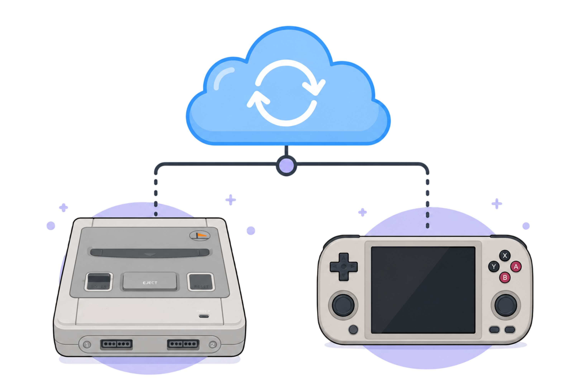
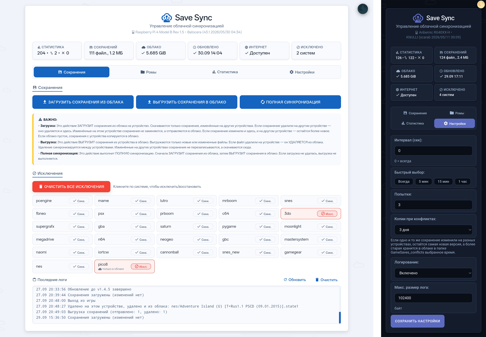
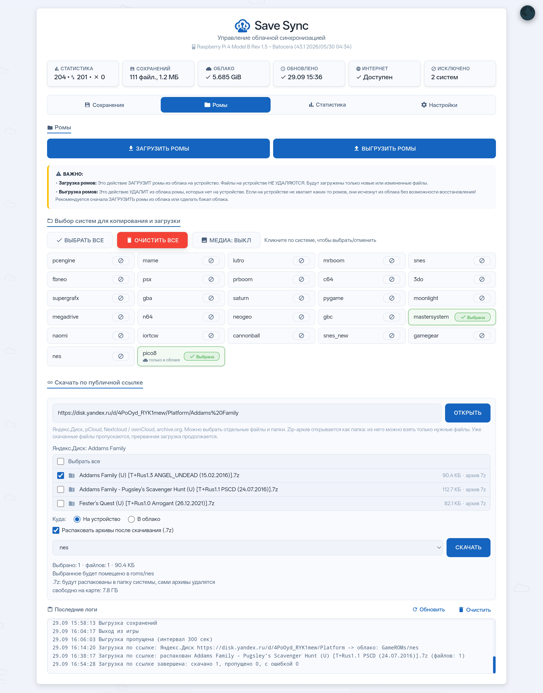
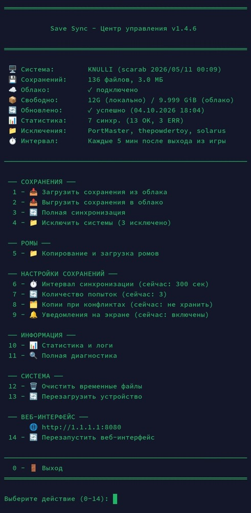
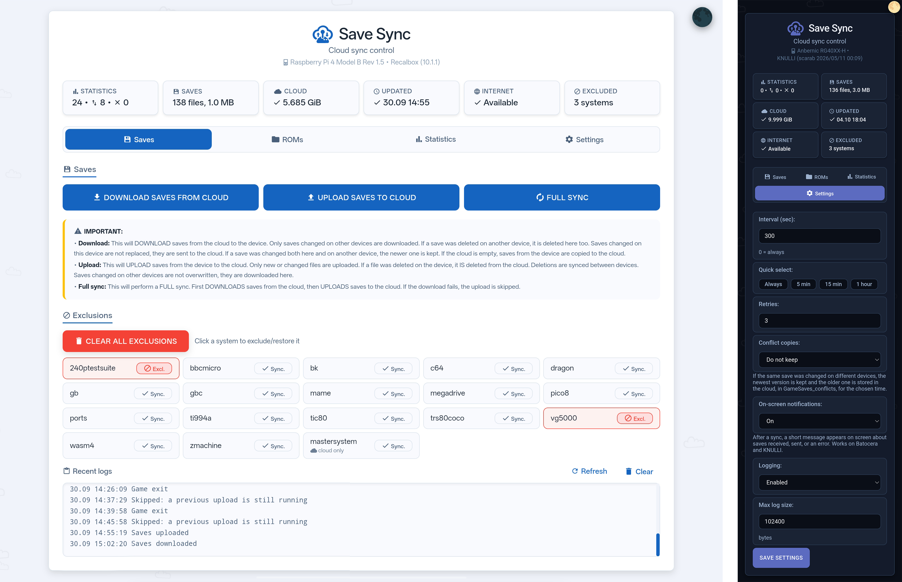
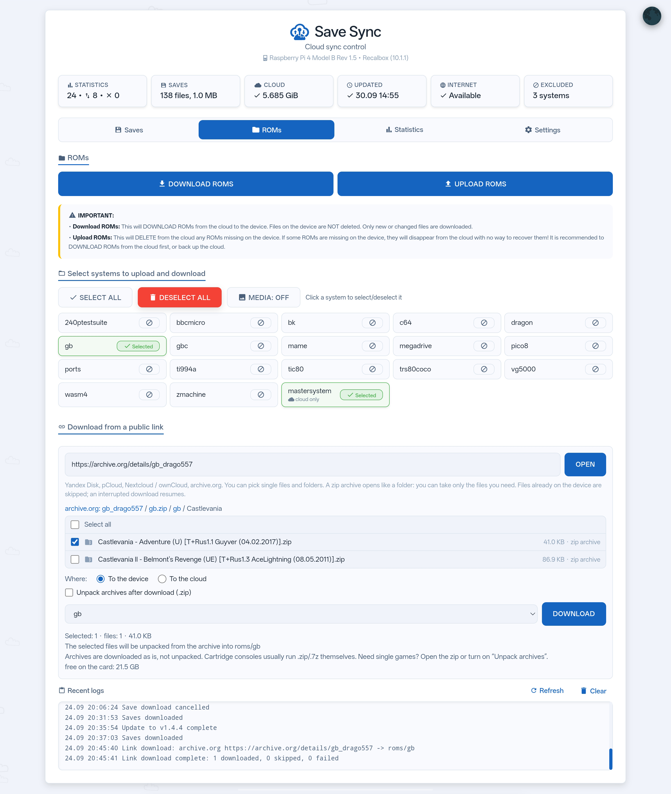
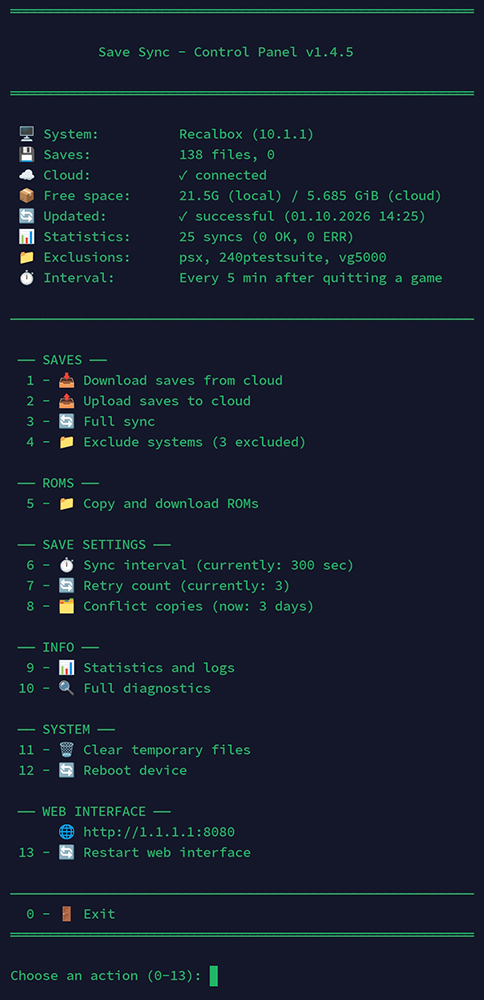

<a name="top"></a>

<p align="center">
  
</p>

<h1 align="center">Save Sync</h1>


**RU** · [English below ↓](#english)

Облачная синхронизация сохранений, копирование и загрузка ромов для ретро-приставок и портативок на **Batocera**, **KNULLI** и **Recalbox**.

Сохранились на одном устройстве — включили другое — продолжаете с того же места. Работает в фоне, не мешает игровому процессу. Управлять можно как с самого устройства (через меню в SSH), так и через веб-интерфейс в браузере.

*Проверено: Batocera 43.1, Recalbox 10.1.1, KNULLI Scarab*

---

## Что умеет

- Автоматически синхронизирует сохранения с облаком по протоколу **WebDAV** (через [rclone](https://rclone.org/))
- Синхронизация при включении и при выходе из игры, всегда в обе стороны: сохранение, изменённое на одном устройстве, уходит в облако и скачивается на остальные
- Удаление тоже синхронизируется — стёрли сохранение на одном устройстве, оно исчезнет из облака и удалится с остальных устройств
- Можно играть на нескольких устройствах сразу: прогресс не перезаписывается вслепую, а если одно и то же сохранение изменили на разных устройствах, остаётся более новая версия, а более старую можно хранить копией в `GameSaves_conflicts` (по умолчанию 3 дня, можно выключить)
- На устройство скачиваются только сохранения тех систем, ромы которых есть на устройстве. Для остальных систем сохранения остаются в облаке и не занимают место на устройстве
- Сохранения портов PortMaster синхронизируются автоматически — только сами сохранения, без данных игры и настроек экрана
- Копирование и загрузка ромов — выгрузить коллекцию в облако или скачать оттуда ромы (и целые системы), которых ещё нет локально
- Загрузка ромов по публичной ссылке (Яндекс.Диск, pCloud, Nextcloud / ownCloud, archive.org) — сразу на устройство или в облако: можно выбрать отдельные файлы и папки, взять нужные игры из zip-архива, распаковать .zip / .7z / .rar
- Не нужно постоянно включённое устройство: не требуется, чтобы оба девайса были онлайн одновременно, и не нужен отдельный сервер или NAS — только обычный облачный WebDAV-аккаунт
- Показывает на экране короткое уведомление после синхронизации: что получено и отправлено, или ошибку. Работает на Batocera и KNULLI, на Recalbox уведомлений нет. Включается и выключается в центре управления и в веб-интерфейсе
- Работает с любым числом устройств в любом сочетании систем

## Как работает синхронизация

При каждой синхронизации устройство и облако сравниваются с тем, как всё выглядело в прошлый раз, и переносится только то, что изменилось:

| Что произошло | Что будет |
|---|---|
| Сохранение изменили на одном устройстве | новая версия уходит в облако и скачивается на остальные устройства |
| Сохранение удалили на одном устройстве | оно удаляется из облака и с остальных устройств |
| Сохранение изменили на разных устройствах | остаётся более новая версия |

**Включили устройство** — забирает сохранения, изменённые на других устройствах. Если играли на другом, прогресс уже будет здесь.

**Вышли из игры** — отправляет то, что изменилось на этом устройстве, и заодно забирает изменённое на других.

**Удалили сохранение** — при следующей синхронизации (например, при выходе из игры) оно удалится из облака, а на других устройствах — при их следующей синхронизации.

**Одно и то же сохранение изменили на разных устройствах** — остаётся более новая версия, а более старую можно хранить копией в папке `GameSaves_conflicts` в облаке, с именем устройства и датой, например `snes/Zelda.srm.KNULLI-3f2a.2026-09-27_18-40-00`. Ничего спрашивать не будет, в лог попадёт строка о конфликте. Сколько дней хранить такие копии, задаётся в настройке «Копии при конфликтах» (веб-интерфейс или центр управления): по умолчанию 3 дня, 0 — не хранить. Срок считается с момента конфликта, а старые копии удаляет любое устройство при своей синхронизации.

**Какие сохранения синхронизируются** — только систем, в которые играют на этом устройстве: если для системы здесь есть ромы или её сохранения уже лежат на устройстве. Сохранения остальных систем остаются в облаке и сюда не скачиваются; появились ромы — система подключится при следующей синхронизации, и сохранения из облака придут первыми. Любую систему можно исключить вручную, а системы, у которых сохранения есть только в облаке, показываются в списке исключений с пометкой «только в облаке».

> **Совет:** чтобы сохранения переходили между устройствами, выбирайте для системы одно и то же ядро (эмулятор) на всех устройствах. Разные ядра — например, для PS1 или N64 — хранят сохранения в разных форматах и под разными именами, и другое ядро их просто не увидит.

## Скриншоты







## Поддерживаемые облака

Подойдёт любое хранилище с поддержкой WebDAV, включая:

- Яндекс.Диск
- Облако Mail.ru
- pCloud
- Koofr
- Nextcloud / OwnCloud (свой сервер)
- Fastmail Files
- Mega

Для Яндекса, Mail.ru и Fastmail нужен **пароль приложения**, а не обычный пароль от аккаунта — установщик подскажет, где его создать для выбранного сервиса.

## Установка

**1. Скопируйте `install_sync.sh` на устройство**

> Если вам удобнее английский интерфейс — используйте `install_sync_en.sh`
> из того же релиза. Перед запуском переименуйте его в `install_sync.sh`,
> иначе скрипт не найдёт сам себя при автозагрузке.

Проще всего — через сетевую папку:
```
\\batocera\share\system\   (Batocera)
\\knulli\share\system\     (KNULLI)
\\recalbox\share\system\   (Recalbox)
```
Или через FTP (логин `root`, пароль `linux` для Batocera/KNULLI, `recalboxroot` для Recalbox), в папку `system/`.

**2. Подключитесь по SSH**
```bash
ssh root@IP_АДРЕС_УСТРОЙСТВА
```

**3. Запустите установщик**

Batocera / KNULLI:
```bash
chmod +x /userdata/system/install_sync.sh
/userdata/system/install_sync.sh
```
Recalbox:
```bash
chmod +x /recalbox/share/system/install_sync.sh
/recalbox/share/system/install_sync.sh
```

> **На Recalbox выдаёт "Permission denied"?** На части сборок раздел `/recalbox/share` не поддерживает исполнение файлов напрямую. Ставьте `bash` или `sh` перед каждой командой:
> ```bash
> sh /recalbox/share/system/install_sync.sh
> ```

**4. Следуйте инструкциям на экране** — выберите облачный сервис, введите логин и пароль, дождитесь окончания установки. Если скрипт уже установлен, вместо этого предложит обновиться с сохранением текущих настроек.

> **Обновление с прошлых версий:** обновите скрипт на всех своих устройствах, а не только на одном — новая синхронизация ведёт учёт иначе, и устройства со старой и новой версиями будут работать вразнобой.

Для работы нужен `python3` (он же запускает веб-интерфейс): на проверенных версиях Batocera, KNULLI и Recalbox он есть. Если его нет, синхронизация не запустится, а в логе будет написано, чего не хватает.

## Центр управления

Batocera / KNULLI:
```bash
/userdata/system/install_sync.sh --config
```
Recalbox:
```bash
/recalbox/share/system/install_sync.sh --config
```

Всё через меню: загрузка, выгрузка и полная синхронизация сохранений, исключение систем из синхронизации, копирование и загрузка ромов, загрузка по публичной ссылке, интервал синхронизации, количество попыток, копии при конфликтах, статистика и логи, полная диагностика, перезапуск веб-интерфейса.

## Веб-интерфейс

После установки автоматически запускается веб-сервер:
```
http://IP_АДРЕС_УСТРОЙСТВА:8080
```
Дублирует все функции центра управления — синхронизацию, работу с ромами, загрузку по ссылке, исключения, живой прогресс, статистику, логи — из браузера любого устройства в той же сети. (Если не открывается сразу после установки — перезапустите через центр управления или перезагрузите устройство.)

В статистике синхронизации делятся на три группы: без изменений, с изменениями и с ошибкой.

## Загрузка ромов по публичной ссылке

Вставьте ссылку на папку или файл — Save Sync покажет, что внутри, а вы выберете нужное и систему, куда класть. Поддерживаются **Яндекс.Диск**, **pCloud**, **Nextcloud / ownCloud** (в том числе со ссылками на подпапки и с паролем) и **archive.org**.

- Скачивать можно на устройство (в `roms/<система>`) или сразу в облако (`GameROMs/<система>`), ничего не занимая на карте
- Из zip-архива можно выбрать отдельные файлы — читается только нужное, архив целиком качать не придётся
- Скачанные `.zip` / `.7z` / `.rar` можно распаковать — на устройстве или прямо в облаке (для `.7z` и `.rar` нужна программа `7z`, `7zr`, `unrar` или `bsdtar`; на Recalbox обычно доступен только `.7z`)
- Файлы, которые уже есть на устройстве, пропускаются, а прерванная загрузка докачивается при повторном запуске той же ссылки
- Перед началом проверяется свободное место: считается только то, что действительно нужно докачать

Доступно в веб-интерфейсе и в центре управления (пункт «Скачать по публичной ссылке»).

## Диагностика

Batocera / KNULLI:
```bash
/userdata/system/install_sync.sh --info
```
Recalbox:
```bash
/recalbox/share/system/install_sync.sh --info
```
Проверка версии rclone, подключения к облаку, прав на скрипты, значений конфига, свободного места (локально и в облаке), состояния интернета, статистики синхронизаций, последних записей лога — всё в одном месте.

## Создаваемые файлы

В системной папке устройства создаются:

- `install_sync.sh` — установщик / центр управления
- `download_sync.sh`, `upload_sync.sh` — запуск загрузки и выгрузки сохранений
- `sync_engine.py` — сам алгоритм двусторонней синхронизации: что изменилось здесь, что в облаке, конфликты, сохранения портов
- `download_roms.sh`, `upload_roms.sh` — загрузка и выгрузка ромов
- `link_download.py` — загрузка по публичной ссылке
- `sync.conf` — основной конфиг
- `.sync_state`, `.sync_base.json` — состояние синхронизации (как выглядели сохранения при последней синхронизации)
- `roms_filter_sync` — фильтр ромов
- `bin/rclone` — сам rclone
- `.config/rclone/rclone.conf` — конфиг облака
- `logs/save_sync.log` — лог синхронизации

Также добавляется хук выхода из игры (запускает выгрузку сохранений) и строка запуска в файл автозагрузки системы (`custom.sh` или `services/custom_service`).

В облаке используются папки `GameSaves` (сохранения; для портов — `GameSaves/_ports`), `GameROMs` (ромы) и `GameSaves_conflicts` (копии при конфликтах).

## Удаление

Batocera / KNULLI:
```bash
rm -f /userdata/system/download_sync.sh /userdata/system/upload_sync.sh \
      /userdata/system/download_roms.sh /userdata/system/upload_roms.sh \
      /userdata/system/link_download.py /userdata/system/sync_engine.py /userdata/system/.sync_base.json \
      /userdata/system/sync.conf /userdata/system/.sync_state /userdata/system/roms_filter_sync \
      /userdata/system/scripts/save-sync.sh /userdata/system/logs/save_sync.log \
      /userdata/system/.config/rclone/rclone.conf /userdata/system/bin/rclone
sed -i '/download_sync.sh/d' /userdata/system/custom.sh 2>/dev/null
```

Recalbox:
```bash
rm -f /recalbox/share/system/download_sync.sh /recalbox/share/system/upload_sync.sh \
      /recalbox/share/system/download_roms.sh /recalbox/share/system/upload_roms.sh \
      /recalbox/share/system/link_download.py /recalbox/share/system/sync_engine.py /recalbox/share/system/.sync_base.json \
      /recalbox/share/system/sync.conf /recalbox/share/system/.sync_state \
      /recalbox/share/system/roms_filter_sync \
      /recalbox/share/system/logs/save_sync.log \
      /recalbox/share/system/.config/rclone/rclone.conf /recalbox/share/system/bin/rclone \
      "/recalbox/share/userscripts/save-sync[endgame].sh"
sed -i '/download_sync.sh/d' /recalbox/share/system/custom.sh 2>/dev/null
sed -i '/install_sync.sh --web/d' /recalbox/share/system/custom.sh 2>/dev/null
```

## Частые вопросы

**Будет ли работать на других системах?**
Сейчас — Batocera, KNULLI, Recalbox. Если хотите поддержку другой прошивки — заведите issue, посмотрю, что можно сделать.

**Нужен ли постоянный интернет?**
Только ненадолго — при включении устройства и при выходе из игры. Всё остальное время можно играть офлайн, сохранения синхронизируются при следующем подключении к сети.

**Сколько времени занимает синхронизация?**
Зависит от размера файлов и скорости интернета. Крупные сохранения (1–4 МБ) могут идти несколько минут. После игры с тяжёлыми сохранениями не выключайте устройство сразу — дайте немного времени. То же самое при загрузке: большие сохранения подтягиваются не мгновенно.

**Что такое интервал синхронизации?**
Минимальное время между синхронизациями. Например, если установить 5 минут, синхронизация при выходе из игры выполнится, только если с предыдущей прошло больше 5 минут — это помогает не перегружать облако при частых выходах из игры. Если играть на двух устройствах подряд, интервал может отложить отправку, и тогда вместо обычной синхронизации получится конфликт — он разрешается автоматически, остаётся более новая версия.

**Что такое «Копии при конфликтах»?**
Если одно и то же сохранение изменили на двух устройствах до синхронизации, остаётся более новая версия, а проигравшая может храниться в папке `GameSaves_conflicts` в облаке — на случай, если выбрана не та. Срок хранения (по умолчанию 3 дня, 0 — не хранить) настраивается в веб-интерфейсе или центре управления. Вернуть старую версию можно, скопировав файл из этой папки обратно в `GameSaves` и убрав из имени метку устройства и даты.

**Зачем исключать систему из синхронизации?**
Исключение ускоряет синхронизацию и экономит трафик. Некоторые системы (MAME, Final Burn Neo) создают крупные сохранения, которые не обязательно держать в облаке. Исключить можно через центр управления или веб-интерфейс. Исключённая система не скачивается и не выгружается.

**Что значит «только в облаке» в списке исключений?**
Сохранения этой системы лежат в облаке (их загрузило другое устройство), а ромов этой системы на этом устройстве нет. Скачиваться сюда такие сохранения не будут, пока здесь не появятся ромы или сохранения этой системы. Исключать их вручную не нужно.

**Сохранения какой-то системы не скачались на устройство?**
Скорее всего, для этой системы на устройстве нет ромов. Сохранения скачиваются только для систем, в которые играют на этом устройстве. Добавьте ромы (в том числе через загрузку по ссылке или из облака) — при следующей синхронизации сохранения придут.

**Как добавить ромы без кард-ридера и FTP?**
Закиньте их в `GameROMs/<система>/` в облаке, затем запустите загрузку ромов с устройства — они появятся в нужных папках сами. Или вставьте публичную ссылку (Яндекс.Диск, pCloud, Nextcloud, archive.org) в разделе «Скачать по публичной ссылке».

**Что именно делает "Копирование и загрузка ромов"?**
Это не двусторонняя синхронизация, а резервное копирование и восстановление по отдельности. Выгрузка отправляет ромы в облако (создаёт копию), загрузка — забирает их обратно (восстанавливает на устройстве). При выгрузке файлы, которых больше нет на устройстве, удаляются и из облачной копии.

**Удалил сохранение, а в облаке осталось?**
Исчезнет при следующей синхронизации (например, при выходе из игры) — а на других устройствах удалится при их следующей синхронизации. Если хотите синхронизировать сразу, зайдите в любую игру и выйдите, чтобы вызвать синхронизацию принудительно.

**Иконка удалённого сохранения осталась в списке игр?**
Список слотов сохранений интерфейс кэширует. Файл уже удалён, а иконка исчезнет после обновления списка игр или перезапуска интерфейса.

**Сохранение есть, но игра не продолжается с этого места?**
Некоторые эмуляторы (MAME, Final Burn Neo) не подгружают сохранение автоматически при запуске — загрузите вручную горячими клавишами (обычно Select + кнопка).

**Загружается не тот слот сохранения?**
В каждом устройстве свой счётчик слотов. Если на одном сохранение в слоте 3, а на другом — в слоте 2, по горячим клавишам загрузится последний использованный слот именно на этом устройстве. Найдите нужное через менеджер сохранений — либо скопируйте сохранение в свободный слот и загрузите оттуда.

**Внутриигровые сохранения не видны?**
Запустите игру один раз, выйдите и зайдите снова — эмулятор подхватит файл.

**Можно другое облако?**
Да, если оно работает через WebDAV — при установке выберите пункт «Nextcloud/OwnCloud/другой WebDAV» и введите свой адрес сервера.

## Благодарности

Синхронизация построена поверх [rclone](https://rclone.org/), который и делает всю работу по передаче данных через WebDAV.

Багрепорты и предложения — через Issues / Pull Requests.

---

<a name="english"></a>

<p align="center">
  
</p>

<h1 align="center">Save Sync</h1>


**EN** · [Русский выше ↑](#top)

Cloud save synchronization, ROM copying and downloading for retro gaming handhelds and consoles running **Batocera**, **KNULLI**, or **Recalbox**.

Save on one device, turn on another, keep playing from where you left off. Runs quietly in the background — no interruption to your gaming session. Manage everything from the device itself or from a browser on your phone/PC.

*Tested on: Batocera 43.1, Recalbox 10.1.1, KNULLI Scarab*

---

## What it does

- Automatically syncs your save files to the cloud over **WebDAV**, using [rclone](https://rclone.org/) under the hood
- Syncs on boot and on game exit, always both ways: a save changed on one device is uploaded to the cloud and downloaded to your other devices
- Deletions sync too — delete a save on one device, and it disappears from the cloud and is removed from your other devices
- Play on several devices at once: progress is never blindly overwritten, and if the same save was changed on different devices, the newer version is kept and the older one can be stored as a copy in `GameSaves_conflicts` (3 days by default, can be turned off)
- Only the saves of systems whose ROMs are on the device are downloaded to it. For other systems the saves stay in the cloud and take no space on the device
- PortMaster port saves sync automatically — only the saves themselves, not game data or screen settings
- ROM copying and downloading — upload your collection to the cloud, or pull down ROMs (and whole systems) you don't have locally yet
- Download ROMs from a public link (Yandex Disk, pCloud, Nextcloud / ownCloud, archive.org) — straight to the device or the cloud: pick individual files and folders, take just the games you want out of a zip, unpack .zip / .7z / .rar
- No always-on device needed: your devices don't have to be online at the same time, and there's no dedicated server or NAS to run — just a regular cloud WebDAV account
- Shows a short on-screen notification after a sync: what was received and sent, or an error. Works on Batocera and KNULLI; Recalbox has no notifications. Can be turned on and off in the control panel and in the web interface
- Works with any number of devices, in any mix of systems

## How syncing works

On every sync the device and the cloud are compared with how things looked last time, and only what changed is transferred:

| What happened | What happens next |
|---|---|
| A save was changed on one device | the new version is uploaded to the cloud and downloaded to your other devices |
| A save was deleted on one device | it is deleted from the cloud and from your other devices |
| A save was changed on different devices | the newer version is kept |

**Turn on a device** — it pulls saves changed on other devices. If you played on another one, that progress is already here.

**Exit a game** — sends what changed on this device and also pulls what changed on others.

**Delete a save** — it's removed from the cloud on the next sync (for example when you exit a game), and from other devices on their next sync.

**The same save changed on different devices** — the newer version is kept, and the older one can be stored as a copy in the `GameSaves_conflicts` cloud folder, named with the device and date, e.g. `snes/Zelda.srm.KNULLI-3f2a.2026-09-27_18-40-00`. It never asks you anything; a line about the conflict goes to the log. How many days such copies are kept is the "Conflict copies" setting (web interface or control panel): 3 days by default, 0 means don't keep. The age counts from the moment of the conflict, and any device removes old copies during its own sync.

**Which saves are synced** — only those of systems you play on this device: the system has ROMs here, or its saves are already on the device. Saves of other systems stay in the cloud and are not downloaded here; once ROMs appear, the system joins the next sync and the cloud saves come down first. Any system can be excluded manually, and systems whose saves exist only in the cloud are listed among the exclusions with an "only in the cloud" badge.

> **Tip:** for saves to move between devices, pick the same core (emulator) for a system on every device. Different cores — for PS1 or N64, for example — store saves in different formats and under different names, so another core simply won't see them.

## Screenshots







## Supported clouds

Any WebDAV-compatible storage works, including:

- Yandex.Disk
- Mail.ru Cloud
- pCloud
- Koofr
- Nextcloud / ownCloud (bring your own server)
- Fastmail Files
- Mega

Yandex, Mail.ru, and Fastmail require an **app password** rather than your regular account password — the installer will tell you where to generate one for whichever service you pick.

## Installation

**1. Copy `install_sync.sh` onto your device**

> Prefer the English interface? Use `install_sync_en.sh` from the same
> release. Rename it to `install_sync.sh` before running — otherwise the
> script won't find itself on autostart.

Easiest way — over the network:
```
\\batocera\share\system\   (Batocera)
\\knulli\share\system\     (KNULLI)
\\recalbox\share\system\   (Recalbox)
```
Or via FTP (login `root`, password `linux` for Batocera/KNULLI, `recalboxroot` for Recalbox), into the `system/` folder.

**2. SSH into the device**
```bash
ssh root@YOUR_DEVICE_IP
```

**3. Run the installer**

Batocera / KNULLI:
```bash
chmod +x /userdata/system/install_sync.sh
/userdata/system/install_sync.sh
```
Recalbox:
```bash
chmod +x /recalbox/share/system/install_sync.sh
/recalbox/share/system/install_sync.sh
```

> **Recalbox "Permission denied"?** Some Recalbox builds mount `/recalbox/share` in a way that blocks direct execution. Prefix every manual command with `bash` or `sh` instead:
> ```bash
> sh /recalbox/share/system/install_sync.sh
> ```

**4. Follow the prompts** — pick your cloud service, enter your credentials, and installation finishes on its own. If a previous install is detected, you'll be offered an update instead, with your existing settings preserved.

> **Updating from an earlier version:** update the script on all your devices, not just one — the new sync keeps its records differently, so devices on the old and new versions would work out of step.

`python3` is required (it also runs the web interface): it is present on the tested versions of Batocera, KNULLI and Recalbox. If it's missing, syncing won't run and the log will say what's missing.

## Control panel

Batocera / KNULLI:
```bash
/userdata/system/install_sync.sh --config
```
Recalbox:
```bash
/recalbox/share/system/install_sync.sh --config
```

Everything is menu-driven from here: download, upload and full save sync, excluding specific systems from save sync, ROM backup/restore, download from a public link, sync interval, retry count, conflict copies, statistics and logs, full diagnostics, and restarting the web interface.

## Web interface

After installation, a small web server starts automatically:
```
http://YOUR_DEVICE_IP:8080
```
It mirrors every feature in the control panel — sync, ROM management, link downloads, exclusions, live progress, statistics, logs — from any browser on the same network. (If it doesn't come up right away after a fresh install, restart it from the control panel or just reboot the device.)

Statistics split syncs into three groups: without changes, with changes, and with errors.

## Downloading ROMs from a public link

Paste a link to a folder or a file — Save Sync shows what's inside, you pick what you need and the system to put it in. Supported: **Yandex Disk**, **pCloud**, **Nextcloud / ownCloud** (including sub-folder links and password-protected shares) and **archive.org**.

- Download to the device (`roms/<system>`) or straight to the cloud (`GameROMs/<system>`), using no space on the card
- Pick individual files from inside a zip — only what you chose is read, the whole archive doesn't have to be downloaded
- Downloaded `.zip` / `.7z` / `.rar` can be unpacked — on the device or right in the cloud (`.7z` and `.rar` need `7z`, `7zr`, `unrar` or `bsdtar` on the system; on Recalbox usually only `.7z` is available)
- Files already on the device are skipped, and an interrupted download resumes when you run the same link again
- Free space is checked up front, counting only what actually still has to be downloaded

Available in the web interface and in the control panel ("Download from a public link").

## Diagnostics

Batocera / KNULLI:
```bash
/userdata/system/install_sync.sh --info
```
Recalbox:
```bash
/recalbox/share/system/install_sync.sh --info
```
Checks rclone version, cloud connectivity, script permissions, config values, free space (local and cloud), internet status, sync statistics, and recent log entries — all in one place.

## Files created

Inside the device's system folder, the script creates:

- `install_sync.sh` — installer / control panel
- `download_sync.sh`, `upload_sync.sh` — start the save download/upload
- `sync_engine.py` — the two-way sync algorithm itself: what changed here, what changed in the cloud, conflicts, port saves
- `download_roms.sh`, `upload_roms.sh` — ROM download/upload
- `link_download.py` — download from a public link
- `sync.conf` — main config
- `.sync_state`, `.sync_base.json` — sync state (how the saves looked at the last sync)
- `roms_filter_sync` — ROM filter
- `bin/rclone` — rclone itself
- `.config/rclone/rclone.conf` — cloud config
- `logs/save_sync.log` — sync log

It also adds a game-exit hook (triggers the save upload) and a startup line to the system's autostart file (`custom.sh` or `services/custom_service`).

In the cloud it uses the folders `GameSaves` (saves; ports go to `GameSaves/_ports`), `GameROMs` (ROMs) and `GameSaves_conflicts` (conflict copies).

## Uninstall

Batocera / KNULLI:
```bash
rm -f /userdata/system/download_sync.sh /userdata/system/upload_sync.sh \
      /userdata/system/download_roms.sh /userdata/system/upload_roms.sh \
      /userdata/system/link_download.py /userdata/system/sync_engine.py /userdata/system/.sync_base.json \
      /userdata/system/sync.conf /userdata/system/.sync_state /userdata/system/roms_filter_sync \
      /userdata/system/scripts/save-sync.sh /userdata/system/logs/save_sync.log \
      /userdata/system/.config/rclone/rclone.conf /userdata/system/bin/rclone
sed -i '/download_sync.sh/d' /userdata/system/custom.sh 2>/dev/null
```

Recalbox:
```bash
rm -f /recalbox/share/system/download_sync.sh /recalbox/share/system/upload_sync.sh \
      /recalbox/share/system/download_roms.sh /recalbox/share/system/upload_roms.sh \
      /recalbox/share/system/link_download.py /recalbox/share/system/sync_engine.py /recalbox/share/system/.sync_base.json \
      /recalbox/share/system/sync.conf /recalbox/share/system/.sync_state \
      /recalbox/share/system/roms_filter_sync \
      /recalbox/share/system/logs/save_sync.log \
      /recalbox/share/system/.config/rclone/rclone.conf /recalbox/share/system/bin/rclone \
      "/recalbox/share/userscripts/save-sync[endgame].sh"
sed -i '/download_sync.sh/d' /recalbox/share/system/custom.sh 2>/dev/null
sed -i '/install_sync.sh --web/d' /recalbox/share/system/custom.sh 2>/dev/null
```

## FAQ

**Will this work on other systems?**
Currently Batocera, KNULLI, and Recalbox. Open an issue if you'd like another CFW supported — happy to look into it.

**Do I need a constant internet connection?**
Only briefly, at boot and when exiting a game. Play offline the rest of the time; saves sync automatically once you're back online.

**How long does syncing take?**
Depends on file size and connection speed. Larger saves (1–4 MB) can take a few minutes. Don't power off right after a session with heavy saves — give it a moment. Same on download: big saves don't pull down instantly.

**What's the sync interval?**
The minimum time between syncs. Set it to 5 minutes, for example, and a sync on game exit only actually runs if more than 5 minutes have passed since the last one — keeps frequent game-exits from hammering your cloud storage. If you play on two devices one after another, the interval can delay the upload, and you end up with a conflict instead of a plain sync — it is resolved automatically, the newer version is kept.

**What are "Conflict copies"?**
If the same save was changed on two devices before they synced, the newer version is kept and the losing one can be stored in the `GameSaves_conflicts` cloud folder, in case the wrong one was picked. How long (3 days by default, 0 means don't keep) is set in the web interface or the control panel. To get the old version back, copy the file from that folder into `GameSaves` and remove the device and date tag from its name.

**Why exclude a system from sync?**
Excluding a system speeds up sync and saves bandwidth. Some systems (MAME, FinalBurn Neo) produce large save files you may not want cluttering your cloud storage. Exclude them from the control panel or web UI. An excluded system is neither downloaded nor uploaded.

**What does "only in the cloud" mean in the exclusion list?**
The saves of this system are in the cloud (another device uploaded them), but this device has no ROMs for the system. Such saves won't be downloaded here until ROMs or saves of that system appear on this device. You don't have to exclude them manually.

**Saves of some system didn't download to the device?**
Most likely there are no ROMs for that system on the device. Saves are downloaded only for systems you play on this device. Add the ROMs (including via a public link or from the cloud) and the saves will come on the next sync.

**Can I add ROMs without a card reader or FTP access?**
Drop them into `GameROMs/<system>/` in your cloud storage, then run a ROM download from the device — they'll land in the right folders automatically. Or paste a public link (Yandex Disk, pCloud, Nextcloud, archive.org) in "Download from a public link".

**What does "ROM backup and restore" actually do?**
It's not a two-way sync — upload and download are separate, one-directional operations. Upload pushes your ROMs to the cloud as a backup copy; download pulls them back down to restore on a device. On upload, files no longer present locally are removed from the cloud copy too.

**Deleted a save but it's still in the cloud?**
It disappears on the next sync (for example when you exit a game) — and from other devices on their next sync. Launch and quit any game to force a sync right away if you don't want to wait.

**The icon of a deleted save is still in the games list?**
The interface caches the list of save slots. The file is already gone, and the icon disappears after the games list is refreshed or the interface is restarted.

**A save exists but the game doesn't resume from it?**
Some emulators (MAME, FinalBurn Neo) don't auto-load saves on launch — load manually with the in-game hotkey (usually Select + a face button).

**Wrong save slot loads?**
Each device keeps its own slot counter. If one device has your save in slot 3 and another in slot 2, the hotkey loads whichever slot was last used *on that device*. Find the right one via the save manager, or copy the save into an empty slot and load from there.

**In-game saves aren't showing up?**
Launch the game once, exit, and reopen it — the emulator will pick up the file on the next run.

**Can I use a different cloud provider?**
Yes, if it speaks WebDAV — pick the "Nextcloud/ownCloud/other WebDAV" option during setup and enter your own server URL.

## Credits

Built on top of [rclone](https://rclone.org/) for the actual WebDAV transfer work.

Contributions, bug reports, and feature requests are welcome via Issues / Pull Requests.
